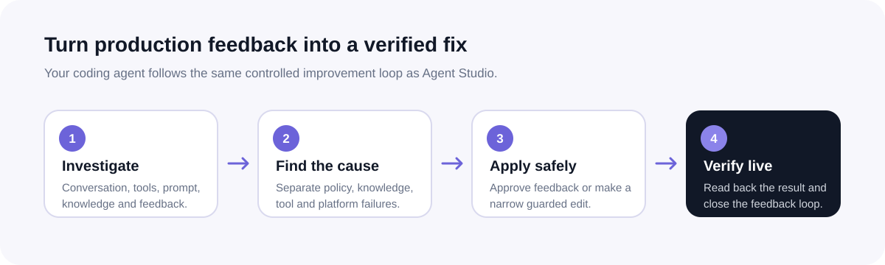

<p align="center">
  <a href="https://www.getadelante.com/">
    
  </a>
</p>

<h1 align="center">Manage your live support agent from Codex, Claude Code, or Cursor</h1>

<p align="center">
  Investigate support conversations, fix prompt and knowledge problems,<br>
  and check the result in Agent Studio.
</p>

<p align="center">
  <a href="https://www.getadelante.com/agent-platform"><strong>Explore Agent Studio</strong></a>
  ·
  <a href="https://www.getadelante.com/quiz"><strong>Get your AI agent</strong></a>
  ·
  <a href="https://github.com/tam1r/agent-skills/releases"><strong>Releases</strong></a>
</p>

<p align="center">
  <a href="https://skills.sh/tam1r/agent-skills"></a>
  <a href="https://github.com/tam1r/agent-skills/releases"></a>
  <a href="LICENSE"></a>
</p>

---

## Adelante Agent Studio Analyst

The Analyst skill teaches your coding agent how to work safely in Adelante Agent Studio. It reads
the customer conversation, prompt, knowledge, assigned-tool contracts, and feedback before it
changes anything. When the cause is clear, it applies the smallest authorized fix and reads the
live configuration again to make sure the change stuck.

<p align="center">
  
</p>

### What you can do

| Use case | What your coding agent does |
|---|---|
| Investigate a ticket | Reconstructs the conversation, tool calls, retrieved knowledge, prompt rules, and feedback |
| Triage feedback | Groups recurring issues, separates root causes, and identifies the smallest safe fix |
| Improve knowledge | Updates a scoped internal snippet or directs you to the authoritative URL source |
| Improve behavior | Applies a guarded prompt change only when a broad behavioral rule is necessary |
| Audit your agent | Finds contradictions across prompt, knowledge, and available assigned-tool contracts |
| Report outcomes | Analyzes support volume, handovers, resolution patterns, and attributed revenue |

## Install

Install the skill globally and let the Skills CLI detect your coding agents:

```bash
npx skills add tam1r/agent-skills \
  --skill adelante-agent-studio-analyst \
  -g -y
```

Or target one coding agent explicitly:

```bash
npx skills add tam1r/agent-skills \
  --skill adelante-agent-studio-analyst \
  --agent codex \
  -g -y
```

Replace `codex` with `claude-code`, `cursor`, or another agent supported by the
[Skills CLI](https://github.com/vercel-labs/skills).

## Connect Agent Studio

The skill includes the MCP setup instructions. Adelante gives each customer a scoped Agent Studio
API key. Keep it out of git and load it from an environment variable.

Once connected, start with:

> Show me the production agents I can access and summarize their pending feedback. Do not change
> anything yet.

Then ask:

> Investigate ticket 96728. Reconstruct what happened, inspect the prompt, retrieved knowledge,
> and tool results, then identify the root cause. Do not make changes.

## Stay up to date

```bash
npx skills update -g adelante-agent-studio-analyst -y
```

Installed copies are not updated automatically. Run this when Adelante announces a new version or
add it to your coding-agent startup workflow.

## Weekly CX operations review

The `cx-operations-review` skill adds a read-only view of handover effort, CSAT,
value and up to three automation priorities to the weekly digest. It covers
bot-touched support and its human handovers in the existing team destination.
It does not change the bot, create schedules or assess individual staff.

**Release prerequisite:** this skill is not a standalone installation. Publish it
only in a combined release containing the aligned `adelante-agent-studio-analyst`,
`cx-weekly-digest`, `cx-fix-loop` and `cx-operations-review` skills. Merge the
[analyst alignment](https://github.com/tam1r/agent-skills/pull/3), then the
[CX lead workflow](https://github.com/tam1r/agent-skills/pull/4), then this operations
review before publishing that release. Installing from a branch with only the
operations-review file cannot produce a report: it stops when prerequisites are
missing or incompatible.

After all four skills are available on `main`, install them together in the same
agent environment:

```bash
npx skills add tam1r/agent-skills --skill adelante-agent-studio-analyst -g -y
npx skills add tam1r/agent-skills --skill cx-weekly-digest -g -y
npx skills add tam1r/agent-skills --skill cx-fix-loop -g -y
npx skills add tam1r/agent-skills --skill cx-operations-review -g -y
```

Then ask:

> Prepare a read-only weekly operations review for my assigned support agent.
> Include handover effort, CSAT and the top three evidence-backed priorities.
> Do not change anything or create a schedule.

Managed FDE runtimes receive these skills through a reviewed, pinned release and
an authorized FDE deployment; these global installation commands do not update
customer runtimes. A source release alone does not activate recurring reports.

## Want an AI support agent for your business?

[Adelante](https://www.getadelante.com/) builds, launches, and continuously improves AI support
agents that answer customers, use approved tools, complete support work, and hand off with context.

**[Get your AI agent →](https://www.getadelante.com/quiz)**

---

<p align="center">
  <a href="https://www.getadelante.com/">Website</a>
  ·
  <a href="https://www.getadelante.com/agent-platform">Agent Studio</a>
  ·
  <a href="mailto:help@getadelante.com">Support</a>
</p>
